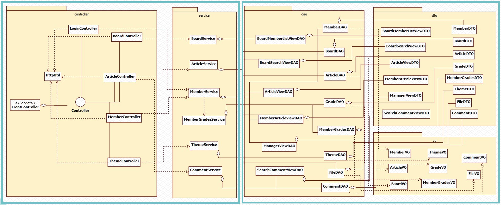

# Servlet/JSP 프로젝트

이 프로젝트는 MVC Model2 패턴을 적용해 FrontController, Controller, Service, DAO로 나누어져 있습니다.  

## 동작 과정
1. FrontController를 통해 요청을 받는다.
2. 최초 요청일 경우 init()가 실행되 Controller들을 생성해 Map에 저장한다. (key : 경로, value : Controller객체)
3. Service(HttpServletRequest request, HttpServletResponse response)가 실행되어 request.getRequestURI()를 호출해 URI를 받아오고 여기서 실행할 path를 추출한다. (`article.do` 이런 형식으로 되어있는 path)
4. ②에서 생성한 Map에 ③에서 추출한 경로를 사용해 map.get(path)를 통해 Controller객체를 가져와 controller.execute(request, response);를 실행한다.  
execute()-> Controller interface에 있는 메소드
5. controller.excute(request, response)를 실행하면 해당 컨트롤러에서 구현한 execute메소드가 실행된다.
6. controller에서는 request.getParameter("job");로 얻은 정보로 어떠한 일을 처리할지 구분하고 해당 요청을 처리하는 메소드를 실행한다.  
(service class는 싱글톤으로 되어있어 execute메소드에서 getInstance()를 통해 참조 가져옴)
7. 처리할 메소드에서 Service Class의 참조를 이용해 메소드를 실행한다.
8. Service Class는 DAO Class를 이용해 DB와 연결해 작업을 수행한다. DAO Class에서는 ConnectDB Class를 이용해 DB에 접속하고 쿼리를 실행해 작업을 수행한다.

* prepareStatement사용
pstmt = con.prepareStatement("insert into article_tb values(?,?,?,?,?,?,?,?)"); pstmt.setInt(1, articleDTO.getArticleHits()); pstmt.setString(2, articleDTO.getArticleTitle()); pstmt.setString(3, articleDTO.getArticleContent()); pstmt.setString(4, newCode); pstmt.setBoolean(5, articleDTO.getNotice()); pstmt.setString(6, articleDTO.getArticleDate()); pstmt.setString(7, articleDTO.getBoardCode()); pstmt.setString(8, articleDTO.getMemberId()); res = pstmt.executeUpdate();
