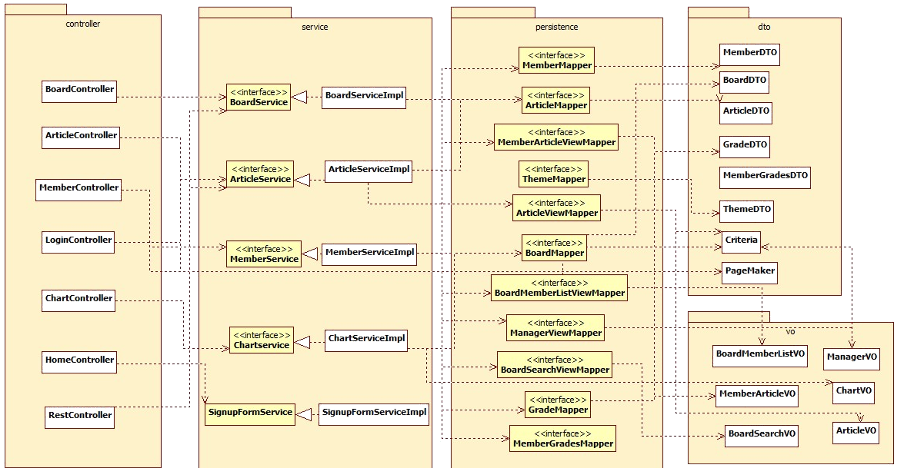

# Spring 프로젝트



이 프로젝트는 Spring MVC패턴을 적용해 개발해 Controller, Service, Mapper Interpace를 가지고 있는 Persistance 계층으로 나누어있고 Mapper Interface는 쿼리를 가지고 있는 Mapper XML파일과 매핑되어 동작합니다.

1. Client로 부터 요청이 들어오면 DispatcherServlet이 요청을 받습니다.  
  → **DispatcherServlet은 web.xml에 등록해 사용**
    ```xml
    <servlet>
  		<servlet-name>appServlet</servlet-name>
  		<servlet-class>org.springframework.web.servlet.DispatcherServlet</servlet-class>
  		<init-param>
  			<param-name>contextConfigLocation</param-name>
  			<param-value>/WEB-INF/spring/appServlet/servlet-context.xml</param-value>
  		</init-param>
  		<load-on-startup>1</load-on-startup>
    </servlet>

    <servlet-mapping>
  		<servlet-name>appServlet</servlet-name>
  		<url-pattern>/</url-pattern>
    </servlet-mapping>
    ```
    **Servlet/JSP와 차이점**
    → 이 과정을 통해 Servlet/JSP에서 HttpServlet을 상속받아 FrontController를 만들었던 과정을 하지 않아도 된다.

2. 요청을 받은 DispatcherServlet은 Handler Mapping을 통해 사용할 Controller의 이름을 받습니다.
  * jsp파일
      ```jsp
      $form.attr('action','/a_detailarticle');
      ```
  * Controller파일
    ```java
    @RequestMapping(value="/a_detailarticle", method=RequestMethod.GET)
    ```
3. DispatcherServlet이 전달 받은 이름의 Controller에게 요청을 처리하게 시킵니다.  
  **Servlet/JSP와 차이점**
  → Servlet/JSP에서는 **최초호출시** 이 과정전에 FrontController에서 init()를 이용해 Controller를 인스턴스화하는데 Spring에서는 주입을 통해 이 객체 사용전 생성하여 참조를 받아 사용
4. Controller는 주입시켜놓은 Service의 참조를 이용해 Service Interface를 구현한 구현클래스에 접근해 Mapper Interface의 메소드를 호출하면 ORM프레임워크를 통해 맵핑된 Mapper XML파일의 쿼리가 실행되어 Database에 접근해 작업을 처리하게 됩니다.
  * Service 주입
    ```java
    @Autowired
    ArticleService articleService;
    ```  

  **Mapper Interface의 메소드명과 XML파일의 ID가 맵핑**
  * ArticeMapper interface 일부
    ```java
    public interface ArticleMapper {
    	public boolean addArticle(ArticleDTO articleDTO) throws Exception;
    	public boolean updateArticleParams(@Param("articleCode")String articleCode,@Param("articleHits")int articleHits,@Param("articleTitle") String articleTitle, @Param("articleContent")String articleContent,@Param("notice") boolean notice, @Param("articleDate")String articleDate, @Param("boardCode")String boardCode, @Param("memberId")String memberId)throws Exception;
    }
    ```
  * ArticleMapper.xml파일 일부
    ```xml
      <mapper namespace="com.persistence.ArticleMapper"\>
        <insert id="addArticle">
      		insert into article_tb(article_hits, article_title, article_content, article_code,
      		notice, board_code, article_date, member_id)
      		values(#{articleHits},#{articleTitle},#{articleContent},#{articleCode},
      		#{notice},#{boardCode},now(),#{memberId})
        </insert>

        <update id="updateArticleParams">
      		update article_tb set
      		article_hits=#{articleHits}
      		,article_title=#{articleTitle}
      		,article_content=#{articleContent}
      		,article_date=now()
      		,member_id=#{memberId}
      		where article_code=#{articleCode}
        </update>
      </mapper>
    ```
